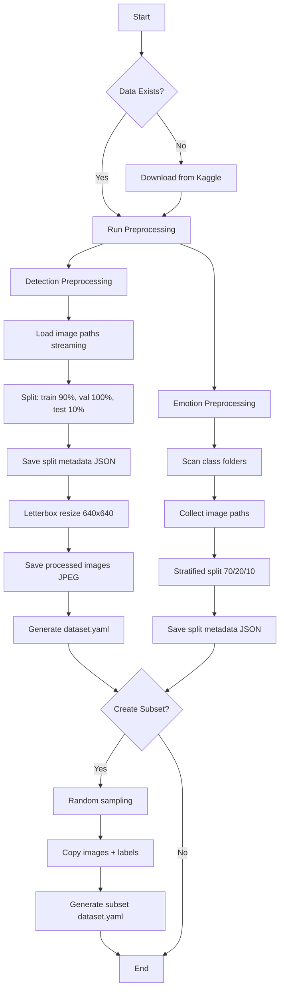

# Data Processing Workflow - Complete Documentation

**Document Purpose**: This document provides a complete overview of the data processing pipeline for the Visual Dog Emotion Recognition project. It serves as a reference for understanding how raw datasets are transformed into training-ready formats.

**Last Updated**: 2026-04-22  
**Version**: 1.0

---

## Table of Contents

1. [Overview](#overview)
2. [Dataset Sources](#dataset-sources)
3. [Directory Structure](#directory-structure)
4. [Detection Dataset Processing](#detection-dataset-processing)
5. [Emotion Dataset Processing](#emotion-dataset-processing)
6. [Subset Creation for Testing](#subset-creation-for-testing)
7. [Execution Flow](#execution-flow)
8. [Configuration](#configuration)
9. [Output Formats](#output-formats)
10. [Troubleshooting](#troubleshooting)

---

## Overview

### System Architecture

The data processing system consists of three main components:

1. **Detection Preprocessor** (`src/data_processing/detection_preprocessor.py`)
   - Processes dog face detection dataset
   - Applies letterbox resize to preserve aspect ratio
   - Converts to YOLOv8 format

2. **Emotion Preprocessor** (`src/data_processing/emotion_preprocessor.py`)
   - Organizes emotion classification dataset
   - Creates stratified train/val/test splits
   - No image preprocessing (images loaded on-the-fly)

3. **Subset Creator** (`src/data_processing/create_detection_subset.py`)
   - Creates small subsets from processed detection data
   - Used for quick testing and debugging
   - Maintains data integrity (image-label pairs)

### Processing Philosophy

- **Detection**: Heavy preprocessing with disk-based storage to handle large images efficiently
- **Emotion**: Minimal preprocessing, path-based references for flexibility
- **Memory Management**: Streaming approach to avoid OOM errors with large datasets
- **Reproducibility**: All splits use fixed random seeds (random_state=42)

---

## Dataset Sources

### Detection Dataset

**Source**: Kaggle dataset `jessicali9530/dog-face-detection`

**Raw Structure**:
```
data/raw/detection_dataset/
├── train_img/          # 5,924 training images (.jpg)
├── train_label/        # 5,924 YOLO format labels (.txt)
├── val_img/            # 230 validation images (.jpg)
└── val_label/          # 230 YOLO format labels (.txt)
```

**Label Format** (YOLO):
```
class_id x_center y_center width height
```
- All coordinates normalized to [0, 1]
- Each `.txt` file may contain multiple bounding boxes (multi-dog images)
- Single class: dog_face (class_id = 0)

### Emotion Dataset

**Source**: Kaggle dataset `tongpython/dog-emotions-5-classes`

**Raw Structure**:
```
data/raw/emotion_dataset/
├── alert/      # 1,865 images
├── angry/      # 1,865 images
├── frown/      # 1,865 images
├── happy/      # 1,865 images
└── relax/      # 1,865 images
```

**Classes**: 5 emotion categories
- Total: ~9,325 images
- Balanced distribution across classes

---

## Directory Structure

### Input Directories
```
data/
└── raw/
    ├── detection_dataset/     # Raw detection data
    └── emotion_dataset/       # Raw emotion data
```

### Output Directories
```
data/
├── processed/
│   ├── detection/             # Processed detection dataset
│   │   ├── train/
│   │   │   ├── img_00000.jpg
│   │   │   └── labels/
│   │   │       └── img_00000.txt
│   │   ├── valid/
│   │   │   ├── img_XXXXX.jpg
│   │   │   └── labels/
│   │   │       └── img_XXXXX.txt
│   │   ├── test/
│   │   │   ├── img_XXXXX.jpg
│   │   │   └── labels/
│   │   │       └── img_XXXXX.txt
│   │   └── dataset.yaml       # YOLOv8 config
│   └── detection_small/       # Optional subset for testing
│       └── (same structure as above)
└── splitting/
    ├── detection_split/       # Detection split metadata
    │   ├── train_split.json
    │   ├── val_split.json
    │   ├── test_split.json
    │   └── metadata.json
    └── emotion_split/         # Emotion split metadata
        ├── train_split.json
        ├── val_split.json
        ├── test_split.json
        └── metadata.json
```

---

## Detection Dataset Processing

### Processing Pipeline

#### Step 1: Load All Data (Streaming Mode)

**Method**: `_load_all_data_streaming()`

**Process**:
1. Sequentially loads train and val splits to minimize memory usage
2. Reads image paths (not pixel data) to save memory
3. Parses YOLO format labels into structured lists
4. Returns: `(image_paths, annotations)` tuples

**Memory Optimization**:
- Only stores file paths in memory (~KB per image)
- Clears train data before loading val data
- Uses `gc.collect()` after each split

**Code Flow**:
```python
# Load train split
train_images, train_annotations = _load_split_data_generator('train')
all_images.extend(train_images)
all_annotations.extend(train_annotations)
del train_images, train_annotations  # Free memory
gc.collect()

# Load val split
val_images, val_annotations = _load_split_data_generator('val')
all_images.extend(val_images)
all_annotations.extend(val_annotations)
```

#### Step 2: Split Dataset (Respecting Original Structure)

**Strategy**: Option A - Preserve original val, split train into train/test

**Rationale**:
- Original dataset already has professional train/val split
- Preserves this split to maintain data quality
- Creates test set from training data only

**Split Ratios**:
- **Train**: 90% of original train_img (~5,332 images)
- **Valid**: 100% of original val_img (230 images, kept as-is)
- **Test**: 10% of original train_img (~592 images)

**Implementation**:
```python
from sklearn.model_selection import train_test_split

# Use original val as validation (no splitting)
X_val = val_images
y_val = val_annotations

# Split original train into train (90%) and test (10%)
X_train, X_test, y_train, y_test = train_test_split(
    train_images, 
    train_annotations, 
    test_size=0.10, 
    random_state=42
)
```

#### Step 3: Save Split Metadata

**Location**: `data/splitting/detection_split/`

**Files Created**:
1. `train_split.json` - Original paths of training images
2. `val_split.json` - Original paths of validation images
3. `test_split.json` - Original paths of test images
4. `metadata.json` - Overall dataset statistics

**Purpose**:
- Records which original images belong to each split
- Useful for auditing and reproducibility
- Does NOT contain processed image data (only paths)

**Metadata Example**:
```json
{
  "dataset_type": "detection",
  "total_samples": 6154,
  "split_strategy": "Option A: Preserve original val, split train into train/test",
  "splits": {
    "train": {"count": 5332, "source": "train_img (90%)"},
    "val": {"count": 230, "source": "val_img (100%, kept as-is)"},
    "test": {"count": 592, "source": "train_img (10%)"}
  },
  "format": "YOLO",
  "preprocessing": "letterbox_resize",
  "target_size": 640
}
```

#### Step 4-6: Process and Save Each Split

**Method**: `_preprocess_and_save_split()`

**Processing Steps**:

##### 4.1 Letterbox Resize

**Purpose**: Preserve aspect ratio while resizing to 640x640

**Algorithm**:
```python
def _letterbox_resize(img, bboxes, target_size=640):
    h, w = img.shape[:2]
    
    # Calculate scale ratio (keep aspect ratio)
    scale = min(target_size / w, target_size / h)
    
    # Resize
    new_w, new_h = int(w * scale), int(h * scale)
    img_resized = cv2.resize(img, (new_w, new_h))
    
    # Calculate padding
    pad_w = (target_size - new_w) / 2
    pad_h = (target_size - new_h) / 2
    
    # Add padding (gray color: RGB 114, 114, 114)
    img_padded = cv2.copyMakeBorder(
        img_resized, top, bottom, left, right,
        cv2.BORDER_CONSTANT, value=[114, 114, 114]
    )
    
    # Adjust bounding boxes
    adjusted_bboxes = []
    for bbox in bboxes:
        class_id, x_c, y_c, bw, bh = bbox
        
        # Scale coordinates
        x_c_new = x_c * scale
        y_c_new = y_c * scale
        bw_new = bw * scale
        bh_new = bh * scale
        
        # Add padding offset and normalize
        x_c_final = (x_c_new + pad_w) / target_size
        y_c_final = (y_c_new + pad_h) / target_size
        bw_final = bw_new / target_size
        bh_final = bh_new / target_size
        
        adjusted_bboxes.append([class_id, x_c_final, y_c_final, bw_final, bh_final])
    
    return img_padded, adjusted_bboxes
```

**Key Points**:
- Padding color: Gray (114, 114, 114) - standard for YOLO
- Bounding box coordinates adjusted for both scaling AND padding
- Final coordinates normalized to [0, 1] relative to 640x640

##### 4.2 Batch Processing

**Batch Size**: 100 images per batch

**Rationale**:
- Each 640x640x3 float32 image ≈ 4.7 MB
- Batch of 100 ≈ 470 MB (safe for most systems)
- Balances speed vs memory usage

**Process**:
```python
batch_size = 100
n_batches = (n_images + batch_size - 1) // batch_size

for batch_idx in range(n_batches):
    start_idx = batch_idx * batch_size
    end_idx = min(start_idx + batch_size, n_images)
    
    for i in range(start_idx, end_idx):
        # Process single image
        img = cv2.imread(image_path)
        img_processed, bboxes_processed = _letterbox_resize(img, bboxes)
        
        # Save to disk immediately
        cv2.imwrite(output_path, img_processed)
        save_annotations(label_path, bboxes_processed)
        
        # Clear memory
        del img, img_processed, bboxes_processed
        gc.collect()
    
    # Clear batch memory
    gc.collect()
```

##### 4.3 File Naming Convention

**Images**: `img_XXXXX.jpg` (zero-padded 5-digit index)
- Train: `img_00000.jpg` to `img_05331.jpg`
- Valid: `img_05332.jpg` to `img_05561.jpg`
- Test: `img_05562.jpg` to `img_06153.jpg`

**Labels**: `img_XXXXX.txt` (matching image names)

**Example Label File** (`img_00000.txt`):
```
0 0.523456 0.412345 0.156789 0.234567
```

##### 4.4 Error Handling

**Damaged Files**:
- Skips unreadable images silently
- Logs failed images to `failed_{split}_images.txt`
- Continues processing remaining images

**Warning Suppression**:
- Redirects OpenCV C++ warnings to `/dev/null`
- Keeps console output clean
- Only shows application-level messages

#### Step 7: Generate YOLOv8 Configuration

**File**: `data/processed/detection/dataset.yaml`

**Content**:
```yaml
path: data/processed/detection  # Relative path from project root
train: train                     # Relative to path
val: valid                       # Relative to path
test: test                       # Relative to path

nc: 1                            # Number of classes
names: ['dog_face']              # Class names
```

**Usage**:
```python
from ultralytics import YOLO

model = YOLO('yolov8m.pt')
model.train(data='data/processed/detection/dataset.yaml', epochs=50)
```

---

## Emotion Dataset Processing

### Processing Philosophy

**Minimal Preprocessing Approach**:
- NO image resizing or normalization during preprocessing
- Images remain in original format and size
- Only creates split indices (JSON files)
- Actual image loading happens during training (on-the-fly)

**Benefits**:
- Faster preprocessing (seconds vs hours)
- Flexible image transformations at training time
- Lower disk space requirements
- Easy to experiment with different augmentations

### Processing Pipeline

#### Step 1: Load and Organize Data

**Method**: `_load_raw_data()`

**Process**:
1. Iterates through 5 emotion class folders
2. Collects all image paths (supports .jpg, .jpeg, .png)
3. Assigns class labels based on folder name
4. Returns: `(image_paths, labels)` lists

**Class Mapping**:
```python
classes = ["angry", "happy", "relax", "frown", "alert"]
class_to_idx = {cls: idx for idx, cls in enumerate(classes)}
# {'angry': 0, 'happy': 1, 'relax': 2, 'frown': 3, 'alert': 4}
```

**Note**: Folder name is `relax` (not `relaxed`) - must match config exactly.

#### Step 2: Stratified Splitting

**Method**: `_split_dataset()`

**Split Ratios**:
- Train: 70%
- Valid: 20%
- Test: 10%

**Stratification**:
- Maintains class distribution across all splits
- Ensures each split has proportional representation of all 5 emotions
- Uses `sklearn.model_selection.train_test_split` with `stratify` parameter

**Two-Stage Splitting**:
```python
from sklearn.model_selection import train_test_split

# Stage 1: Separate test set (10%)
X_temp, X_test, y_temp, y_test = train_test_split(
    images, labels, test_size=0.10, random_state=42, stratify=labels
)

# Stage 2: Split remaining into train (70%) and val (20%)
val_adjusted = 0.20 / (0.70 + 0.20)  # = 0.222...
X_train, X_val, y_train, y_val = train_test_split(
    X_temp, y_temp, test_size=val_adjusted, random_state=42, stratify=y_temp
)
```

**Result Distribution** (approximate):
- Train: ~6,527 images
- Valid: ~1,865 images
- Test: ~933 images

Each split maintains ~20% per class (balanced dataset).

#### Step 3: Save Split Metadata

**Location**: `data/splitting/emotion_split/`

**Files Created**:
1. `train_split.json`
2. `val_split.json`
3. `test_split.json`
4. `metadata.json`

**Split JSON Format**:
```json
{
  "images": [
    "/path/to/data/raw/emotion_dataset/happy/img_001.jpg",
    "/path/to/data/raw/emotion_dataset/angry/img_042.jpg",
    ...
  ],
  "labels": [
    "happy",
    "angry",
    ...
  ]
}
```

**Metadata JSON**:
```json
{
  "dataset_type": "emotion_classification",
  "classes": ["angry", "happy", "relax", "frown", "alert"],
  "class_to_idx": {"angry": 0, "happy": 1, "relax": 2, "frown": 3, "alert": 4},
  "total_samples": 9325,
  "splits": {
    "train": 6527,
    "val": 1865,
    "test": 933
  },
  "class_distribution": {
    "train": {"angry": 1305, "happy": 1306, ...},
    "val": {"angry": 373, "happy": 373, ...},
    "test": {"angry": 187, "happy": 186, ...}
  },
  "format": "folder_based",
  "preprocessing": "none"
}
```

### Training-Time Loading

During training, images are loaded dynamically:

```python
from torch.utils.data import Dataset
from PIL import Image

class EmotionDataset(Dataset):
    def __init__(self, split_json_path, transform=None):
        with open(split_json_path) as f:
            data = json.load(f)
        self.image_paths = data['images']
        self.labels = data['labels']
        self.transform = transform
    
    def __getitem__(self, idx):
        img = Image.open(self.image_paths[idx]).convert('RGB')
        label = self.class_to_idx[self.labels[idx]]
        
        if self.transform:
            img = self.transform(img)
        
        return img, label
```

---

## Subset Creation for Testing

### Purpose

Create small subsets from processed detection dataset for:
- Quick pipeline validation (minutes vs hours)
- Debugging data loading issues
- Testing model architecture changes
- Local CPU development before GPU deployment

### Implementation

**Script**: `src/data_processing/create_detection_subset.py`

**Features**:
1. Random sampling from each split
2. Preserves image-label pairing
3. Maintains YOLOv8 directory structure
4. Auto-generates `dataset.yaml` for subset
5. Tracks creation metadata

### Usage

#### Method 1: Via Shell Script (Recommended)

```bash
# After preprocessing, create default subset (50/10/10)
bash scripts/run_data_preprocessing.sh --create-subset

# Custom sample counts
bash scripts/run_data_preprocessing.sh \
    --create-subset \
    --train-samples 30 \
    --val-samples 5 \
    --test-samples 5
```

#### Method 2: Direct Python Execution

```bash
python src/data_processing/create_detection_subset.py \
    --input_dir data/processed/detection \
    --output_dir data/processed/detection_small \
    --train_samples 100 \
    --val_samples 20 \
    --test_samples 20
```

### Algorithm

```python
def _process_split(split_name, target_count):
    # Get all available images
    image_files = sorted(input_split_dir.glob('*.jpg'))
    
    # Random selection
    actual_count = min(target_count, len(image_files))
    selected_images = random.sample(image_files, actual_count)
    
    # Copy images and corresponding labels
    for img_path in selected_images:
        shutil.copy2(img_path, output_split_dir / img_path.name)
        
        label_path = input_labels_dir / f"{img_path.stem}.txt"
        if label_path.exists():
            shutil.copy2(label_path, output_labels_dir / label_path.name)
```

### Output Structure

```
data/processed/detection_small/
├── train/
│   ├── img_00123.jpg          # 50 randomly selected images
│   ├── img_00456.jpg
│   └── labels/
│       ├── img_00123.txt      # Matching labels
│       └── img_00456.txt
├── valid/
│   ├── img_05400.jpg          # 10 images
│   └── labels/
│       └── img_05400.txt
├── test/
│   ├── img_05600.jpg          # 10 images
│   └── labels/
│       └── img_05600.txt
├── dataset.yaml               # Points to subset paths
└── subset_metadata.json       # Creation info
```

### Integration with Experiments

Use subset by pointing to its `dataset.yaml`:

```python
# In experiment script
trainer = DetectionTrainer(
    config_path='config.yaml',
    dataset_yaml='data/processed/detection_small/dataset.yaml'  # Use subset
)
trainer.train(epochs=5)  # Fewer epochs for testing
```

---

## Execution Flow

### Complete Workflow



### Command-Line Execution

#### Full Pipeline

```bash
# Standard preprocessing (no subset)
bash scripts/run_data_preprocessing.sh

# Preprocessing + subset creation
bash scripts/run_data_preprocessing.sh --create-subset
```

#### Individual Components

```bash
# Only detection preprocessing
python src/data_processing/detection_preprocessor.py

# Only emotion preprocessing
python src/data_processing/emotion_preprocessor.py

# Only subset creation (after preprocessing)
python src/data_processing/create_detection_subset.py
```

### Execution Time Estimates

| Task | Approximate Time | Notes |
|------|-----------------|-------|
| Download detection dataset | 10-30 min | Depends on internet speed |
| Download emotion dataset | 5-15 min | Smaller dataset |
| Detection preprocessing | 15-45 min | Letterbox resize is compute-intensive |
| Emotion preprocessing | < 1 min | Only creates JSON files |
| Subset creation | < 30 sec | File copying only |
| **Total (first run)** | **30-90 min** | Mostly download time |
| **Subsequent runs** | **15-45 min** | Skip downloads |

---

## Configuration

### Global Config (`config.yaml`)

```yaml
paths:
  data_root: "data"
  raw_data: "data/raw"
  processed_data: "data/processed"
  outputs: "outputs"

datasets:
  detection:
    name: "dog_face_detection"
    kaggle_dataset: "jessicali9530/dog-face-detection"
    image_size: 640              # Target size for letterbox resize
    train_ratio: 0.7
    val_ratio: 0.2
    test_ratio: 0.1
    
  emotion:
    name: "dog_emotion"
    kaggle_dataset: "tongpython/dog-emotions-5-classes"
    image_size: 224              # Not used in preprocessing
    classes: ["angry", "happy", "relax", "frown", "alert"]
    train_ratio: 0.7
    val_ratio: 0.2
    test_ratio: 0.1
```

### Key Parameters

#### Detection Preprocessing

| Parameter | Value | Description |
|-----------|-------|-------------|
| `image_size` | 640 | Target dimension for letterbox resize |
| `padding_color` | [114, 114, 114] | Gray padding (YOLO standard) |
| `batch_size` | 100 | Images processed per batch |
| `random_seed` | 42 | For reproducible splits |
| `test_split_ratio` | 0.10 | 10% of train_img becomes test set |

#### Emotion Preprocessing

| Parameter | Value | Description |
|-----------|-------|-------------|
| `train_ratio` | 0.70 | 70% for training |
| `val_ratio` | 0.20 | 20% for validation |
| `test_ratio` | 0.10 | 10% for testing |
| `random_seed` | 42 | For reproducible stratified splits |
| `classes` | 5 | Must match folder names exactly |

#### Subset Creation

| Parameter | Default | Description |
|-----------|---------|-------------|
| `--train_samples` | 50 | Training samples in subset |
| `--val_samples` | 10 | Validation samples in subset |
| `--test_samples` | 10 | Test samples in subset |
| `--input_dir` | `data/processed/detection` | Source dataset |
| `--output_dir` | `data/processed/detection_small` | Output location |

---

## Output Formats

### Detection Dataset Outputs

#### Processed Images

**Format**: JPEG (quality ~95, default OpenCV)
**Size**: 640x640 pixels (with padding)
**Color Space**: BGR (OpenCV default)
**Naming**: Sequential `img_XXXXX.jpg`

#### Annotations

**Format**: YOLO text format
**Encoding**: UTF-8
**Structure**: One line per bounding box
```
class_id x_center y_center width height
```

**Example** (`img_00000.txt`):
```
0 0.523456 0.412345 0.156789 0.234567
0 0.234567 0.678901 0.098765 0.123456
```

**Coordinate System**:
- Normalized to [0, 1] relative to 640x640
- Center-based (x_center, y_center)
- Width and height also normalized

#### Dataset Configuration

**File**: `dataset.yaml`
**Format**: YAML
**Purpose**: YOLOv8 training configuration

```yaml
path: data/processed/detection
train: train
val: valid
test: test
nc: 1
names: ['dog_face']
```

### Emotion Dataset Outputs

#### Split Metadata

**Format**: JSON
**Content**: Image paths and labels (NOT pixel data)
**Size**: ~1-2 MB total (very compact)

**Example** (`train_split.json`):
```json
{
  "images": [
    "/absolute/path/to/data/raw/emotion_dataset/happy/img_001.jpg",
    "/absolute/path/to/data/raw/emotion_dataset/angry/img_042.jpg"
  ],
  "labels": [
    "happy",
    "angry"
  ]
}
```

#### Metadata

**File**: `metadata.json`
**Content**:
- Class distributions per split
- Total sample counts
- Class-to-index mapping
- Dataset statistics

### Subset Outputs

Same format as full detection dataset, plus:

**File**: `subset_metadata.json`
```json
{
  "created_at": "2026-04-22T13:48:16.123456",
  "source_dataset": "data/processed/detection",
  "output_dataset": "data/processed/detection_small",
  "target_samples": {
    "train": 50,
    "valid": 10,
    "test": 10
  },
  "actual_samples": {
    "train": 50,
    "valid": 10,
    "test": 10
  },
  "total_samples": 70,
  "note": "Random subset created for quick testing and debugging"
}
```

---

## Troubleshooting

### Common Issues

#### 1. Memory Errors During Detection Preprocessing

**Symptoms**:
```
MemoryError: Unable to allocate X GiB
```

**Solutions**:
- Reduce batch size in `_preprocess_and_save_split()` (default: 100)
- Close other applications
- Increase swap space
- Use subset for initial testing

**Prevention**:
- Script uses streaming approach to minimize memory
- Calls `gc.collect()` after each batch
- Saves to disk immediately (doesn't accumulate in memory)

#### 2. Missing Label Files

**Symptoms**:
```
Warning: Label file not found for img_12345.jpg
```

**Causes**:
- Corrupted preprocessing
- Manual deletion of files
- Path mismatch

**Solutions**:
```bash
# Check for missing labels
ls data/processed/detection/train/*.jpg | wc -l
ls data/processed/detection/train/labels/*.txt | wc -l

# Re-run preprocessing if counts don't match
bash scripts/run_data_preprocessing.sh
```

#### 3. Class Name Mismatch (Emotion Dataset)

**Symptoms**:
```
KeyError: 'relaxed'
```

**Cause**: Folder is named `relax` but code expects `relaxed`

**Solution**: Ensure `config.yaml` matches actual folder names:
```yaml
classes: ["angry", "happy", "relax", "frown", "alert"]
# NOT "relaxed"
```

#### 4. NumPy Version Conflicts

**Symptoms**:
```
ImportError: numpy.core.multiarray failed to import
```

**Cause**: NumPy 2.x incompatible with some dependencies

**Solution**:
```bash
pip install 'numpy>=1.24.0,<2.0.0' --force-reinstall
```

#### 5. OpenCV Warnings Cluttering Output

**Symptoms**:
```
[ WARN:0@1234] global loadsave.cpp:... Can't open file for reading
```

**Status**: These are suppressed in current implementation via stderr redirection. If they appear, it's a bug.

**Fix**: Check `_preprocess_and_save_split()` for proper stderr handling.

#### 6. Insufficient Disk Space

**Requirements**:
- Raw detection dataset: ~2-3 GB
- Raw emotion dataset: ~1-2 GB
- Processed detection dataset: ~4-6 GB (JPEG files)
- Processed emotion: ~0 GB (only JSON metadata)
- **Total needed**: ~10-15 GB

**Check Space**:
```bash
df -h data/
du -sh data/raw/*
du -sh data/processed/*
```

**Cleanup**:
```bash
# Remove processed data (keep raw)
rm -rf data/processed/detection
rm -rf data/processed/detection_small

# Re-run preprocessing
bash scripts/run_data_preprocessing.sh
```

#### 7. Subset Creation Fails

**Symptoms**:
```
FileNotFoundError: Input directory not found: data/processed/detection
```

**Cause**: Haven't run preprocessing yet

**Solution**:
```bash
# Run preprocessing first
bash scripts/run_data_preprocessing.sh

# Then create subset
bash scripts/run_data_preprocessing.sh --create-subset
```

### Verification Steps

After preprocessing, verify correctness:

```bash
# 1. Check directory structure
tree data/processed/detection/ -L 2

# 2. Count samples
echo "Train images: $(ls data/processed/detection/train/*.jpg | wc -l)"
echo "Valid images: $(ls data/processed/detection/valid/*.jpg | wc -l)"
echo "Test images: $(ls data/processed/detection/test/*.jpg | wc -l)"

# 3. Verify label pairing
echo "Train labels: $(ls data/processed/detection/train/labels/*.txt | wc -l)"

# 4. Check dataset.yaml
cat data/processed/detection/dataset.yaml

# 5. Verify split metadata
cat data/splitting/detection_split/metadata.json | python -m json.tool

# 6. Test with subset
python src/data_processing/create_detection_subset.py --train_samples 5
ls data/processed/detection_small/train/*.jpg | wc -l  # Should be 5
```

### Performance Monitoring

Monitor resource usage during preprocessing:

```python
import psutil
import os

process = psutil.Process(os.getpid())
print(f"Memory usage: {process.memory_info().rss / 1024**2:.1f} MB")
print(f"CPU usage: {process.cpu_percent(interval=1)}%")
```

Add to preprocessing scripts if experiencing issues.

---

## Best Practices

### 1. Always Verify Before Training

```python
from src.data_processing.processed_datasets_verify import verify_processed_datasets

# Call at start of every experiment
verify_processed_datasets()
```

### 2. Use Subsets for Development

- Develop and debug on local CPU with subset
- Switch to full dataset only for final training
- Saves time and GPU resources

### 3. Don't Modify Processed Data Manually

- Processed data should only be modified by preprocessing scripts
- Manual changes can break image-label pairing
- If changes needed, modify preprocessing code and re-run

### 4. Version Control Strategy

```gitignore
# .gitignore
data/raw/
data/processed/
data/splitting/
!readme/DATASET_SUBSET_GUIDE.md
!readme/DATA_PROCESSING.md  # This file
```

- Don't commit raw or processed data
- Commit preprocessing code and documentation
- Share data via compressed archives if needed

### 5. Reproducibility

- All splits use `random_state=42`
- Document any manual interventions
- Keep preprocessing scripts unchanged between runs
- Use same `config.yaml` for consistency

### 6. Backup Strategy

```bash
# Backup processed data before major changes
tar czf backup_processed_$(date +%Y%m%d).tar.gz data/processed/

# Or use rsync for incremental backups
rsync -av data/processed/ /backup/location/processed/
```

---

## Related Documentation

- **Subset Creation Guide**: `readme/DATASET_SUBSET_GUIDE.md`
- **Quick Start**: `readme/QUICKSTART.md`
- **Project Structure**: `readme/PartC-Project Structure.md`
- **Main README**: `readme/README.md`

---

## Change Log

| Date | Version | Changes |
|------|---------|---------|
| 2026-04-22 | 1.0 | Initial comprehensive documentation |

---

## Appendix A: Technical Details

### Letterbox Resize Mathematics

Given:
- Original image: W × H
- Target size: T × T (e.g., 640 × 640)

**Scale Factor**:
```
scale = min(T/W, T/H)
```

**Resized Dimensions**:
```
W' = W × scale
H' = H × scale
```

**Padding**:
```
pad_w = (T - W') / 2
pad_h = (T - H') / 2
```

**Bounding Box Transformation**:
```
x_c_new = (x_c × scale + pad_w) / T
y_c_new = (y_c × scale + pad_h) / T
w_new = (w × scale) / T
h_new = (h × scale) / T
```

### Memory Usage Estimation

**Detection Preprocessing**:
- Image path: ~100 bytes
- Annotation list: ~200 bytes per image (average 2 bboxes)
- Total metadata: ~6,154 images × 300 bytes ≈ 1.8 MB
- Batch processing: 100 images × 4.7 MB ≈ 470 MB peak
- **Total RAM needed**: ~1 GB (comfortable)

**Emotion Preprocessing**:
- Image path: ~100 bytes
- Label string: ~10 bytes
- Total: ~9,325 images × 110 bytes ≈ 1 MB
- **Total RAM needed**: < 100 MB

### File I/O Performance

**Detection**:
- Write speed: ~50-100 images/sec (depends on disk)
- Total time: ~6,154 images / 75 avg ≈ 82 seconds
- Plus resize overhead: ~15-45 minutes total

**Emotion**:
- JSON write: < 1 second
- No image I/O during preprocessing

---

## Appendix B: Code Reference

### Key Functions

#### Detection Preprocessor

| Function | Purpose | Lines |
|----------|---------|-------|
| `__init__()` | Initialize with config | 35-50 |
| `is_processed()` | Check if already processed | 52-66 |
| `process()` | Main pipeline orchestrator | 68-138 |
| `_load_all_data_streaming()` | Load paths without images | 140-175 |
| `_load_split_data_generator()` | Parse YOLO labels | 177-227 |
| `_split_dataset()` | Create train/val/test splits | 229-291 |
| `_save_splits()` | Save metadata JSON | 293-350 |
| `_letterbox_resize()` | Aspect-ratio-preserving resize | 352-405 |
| `_preprocess_and_save_split()` | Process and save batches | 407-520 |
| `_save_processing_metadata()` | Save overall stats | 522-549 |
| `_generate_yolo_dataset_config()` | Create dataset.yaml | 551-581 |

#### Emotion Preprocessor

| Function | Purpose | Lines |
|----------|---------|-------|
| `__init__()` | Initialize with config | 37-50 |
| `is_processed()` | Check if already processed | 52-60 |
| `process()` | Main pipeline orchestrator | 62-100 |
| `_load_raw_data()` | Scan class folders | 102-137 |
| `_split_dataset()` | Stratified splitting | 139-173 |
| `_save_splits()` | Save metadata JSON | 175-218 |

#### Subset Creator

| Function | Purpose | Lines |
|----------|---------|-------|
| `__init__()` | Initialize paths | 29-39 |
| `create_subset()` | Main orchestration | 41-83 |
| `_create_output_structure()` | Create directories | 85-92 |
| `_process_split()` | Sample and copy files | 94-140 |
| `_generate_dataset_yaml()` | Create subset config | 142-159 |
| `_save_metadata()` | Track creation info | 161-184 |

---

**End of Document**

For questions or updates, refer to the code comments in respective Python files.
